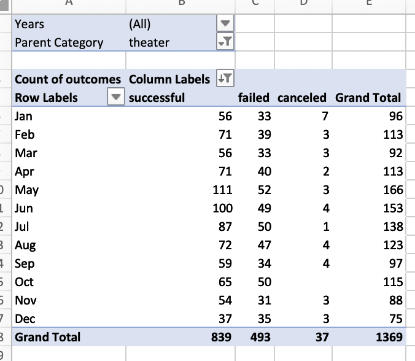
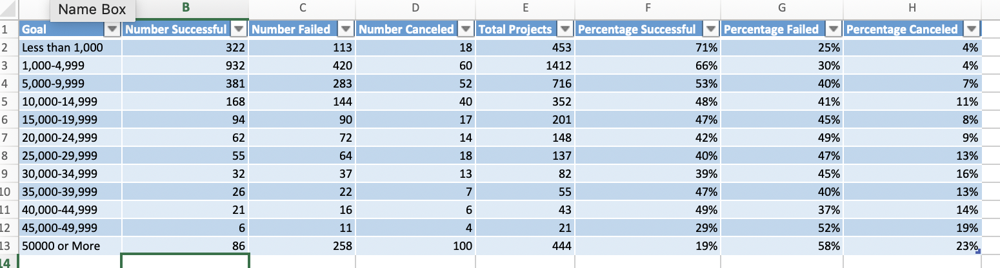
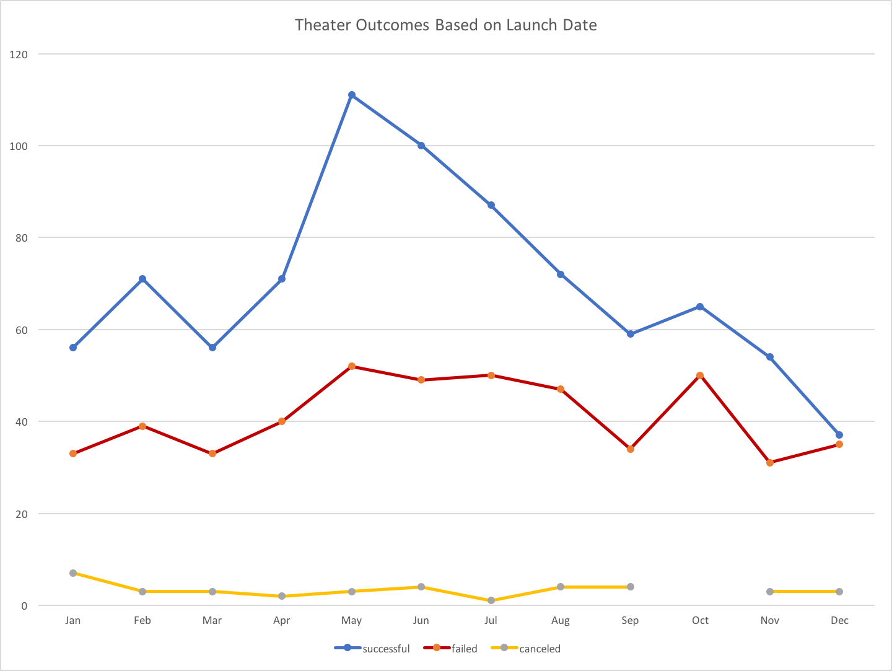
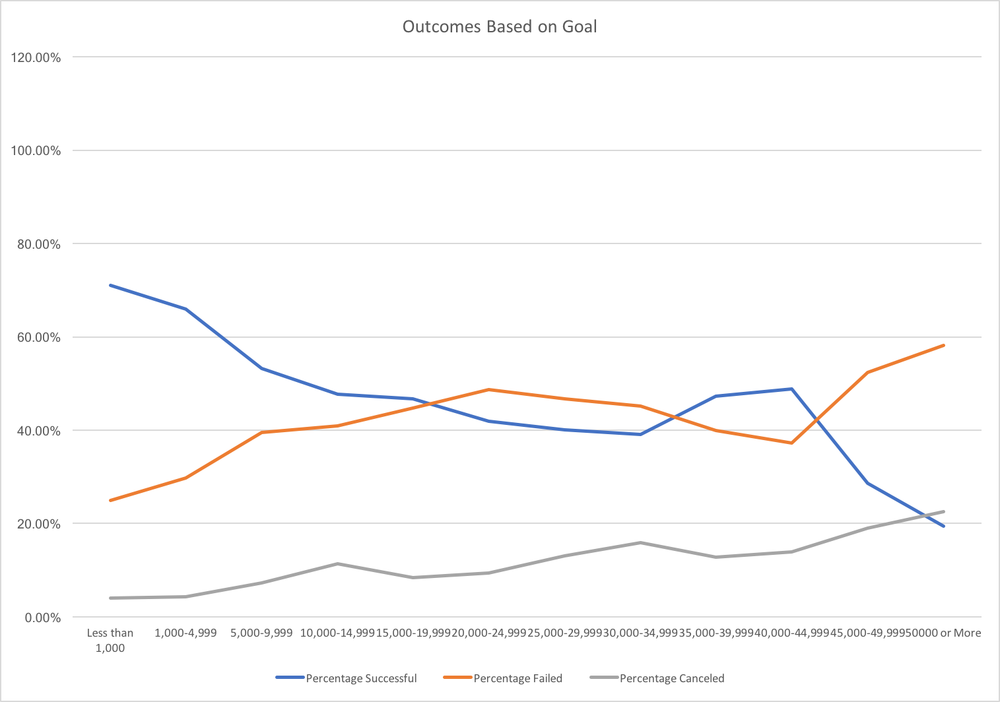

# kickstarter_analysis

## Overview of Project
After seeing how Louise’s play Fever came close to it’s full funding goal in a short period of time, we’re taking a look at data on campaign funding for different creative projects. We use this data to assess theater campaign outcomes by month to find what time of year is the best to fundraise and then we take a look at the outcome of campaigns based on the goal amount to see if there is any correlation between the cost and success.  

Formulas used for row 2 data:
 
B2 =COUNTIFS(KickStarter!F:F,"successful",KickStarter!D:D,"<1000")
C2 =COUNTIFS(KickStarter!F:F,"failed",KickStarter!D:D,"<1000")
D2 =COUNTIFS(KickStarter!F:F,"canceled",KickStarter!D:D,"<1000")
	E2 =SUM(B2:D2)
	F2 =B2/$E2
G2 =C2/$E2
	H2 =D2/$E2

*Formulas were dragged down and modified accordingly. 

There were a few charts that I had to redo as I was missing colons or quotations and it was somewhat confusing. I basically only ran into simple errors, and with the theater outcome chart, I deleted the sheet and started over when I wasn’t able to identify the mistake and that seemed to fix it. Syntax errors were especially an issue when it came to the 3rd row on the outcomes based on goals chart when I needed to add greater than or equal to the lower value plus less than the higher value- for example: C5: =COUNTIFS(KickStarter!F:F,"failed",KickStarter!D:D,
">=10000",KickStarter!D:D,"<15000") 

## Results
### Theater Outcomes by Launch Date

One of the first things that sticks out with outcome based on launch data is that cancellations do not seem to be affected by the time of year. There is no particular season or month in which a significant amount of plays get canceled. This is particularly interesting when you see that despite dramatic changes in successes and failures, cancelations remain constant.

The next conclusion is the most obvious one, the spring season, April, May, and June, is the best time for fundraising, with the peak happening in May. Failures somewhat increased from the Spring to Summer months but overall were relatively consistent throughout the year compared to the successes, which had a much greater degree of variability. 

 
### Outcomes based on Goals 

Though my data does not look like the example on the challenge instructions, the percentage of successful campaigns steadily declines from less than 1,000 until 35,000, and after an interesting spike at 45,000, it steadily declines again. 

## Limitations of the Dataset & Recommendations
This data set is good overall, the sample size is good and it collects a comprehensive amount of data, but there were some minor things that could have been done better. There were a few columns that had some missing data. Additionally, region of the country would have been helpful information to take a closer look at what locations have higher successs or failure. 
